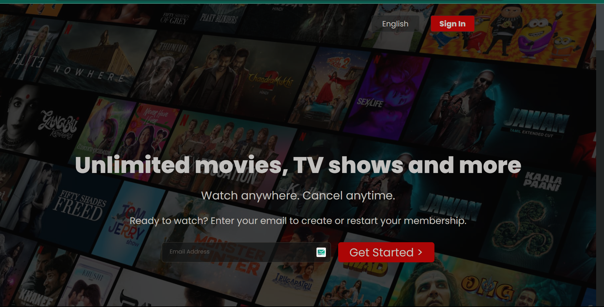
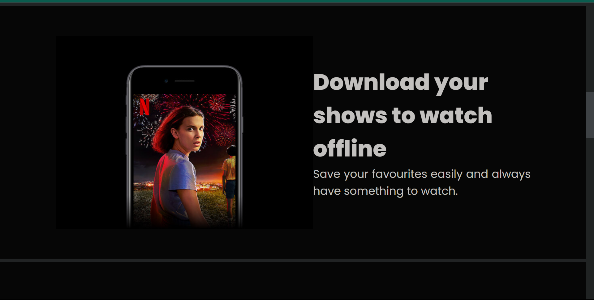

# Netflix Clone - First Responsive Page

## Overview

This project is a simple attempt to recreate the first responsive page of the Netflix interface using HTML and CSS. It serves as a practice exercise for front-end web development and responsive design.

## Features

- **Responsive Design:** The page is designed to be responsive, ensuring a seamless viewing experience on various devices, including desktops, tablets, and smartphones.

- **HTML and CSS:** The project exclusively utilizes HTML for structuring the content and CSS for styling, making it a great example for beginners to understand the fundamentals of web development.

## Technologies Used

- HTML
- CSS
### Screenshot

<kbd></kbd>

<kbd></kbd>

### Mobile View
<kbd></kbd>

